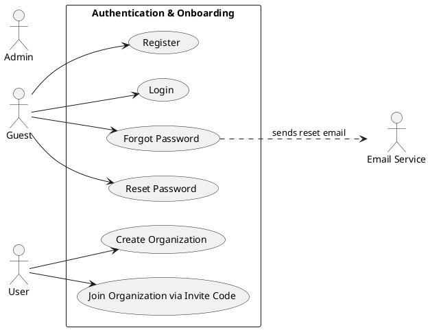
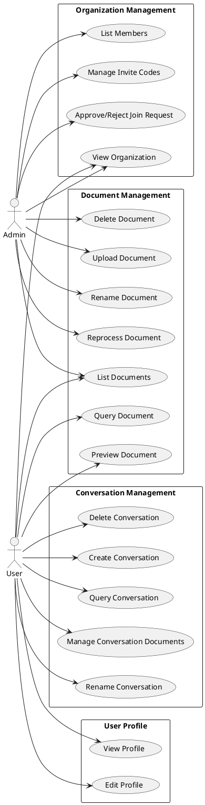

# Chapter 4 Diagrams (PlantUML)

## Diagram 1: Authentication & Onboarding Flow

## Diagram 2: Main System Operations by Role

To render: paste each block at https://www.plantuml.com/plantuml/uml/ and export as PNG.
