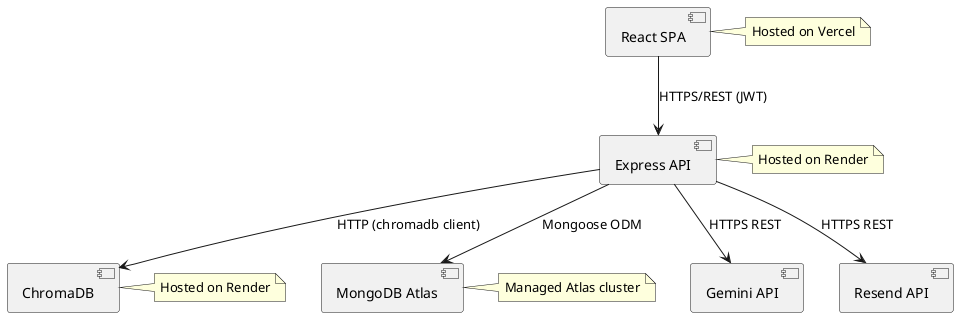
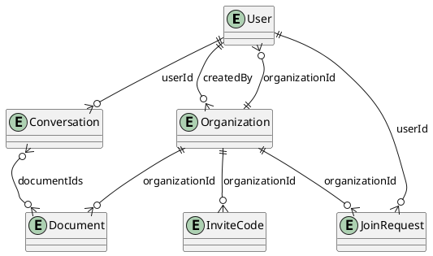

# Chapter 5 Diagrams (PlantUML)



## Diagram 4: Entity Relationship Diagram



  ## Diagram 5: Authentication Sequence Diagram

  ```plantuml
  @startuml Authentication_Sequence
  actor Client
  participant "Auth Controller" as AuthController
  participant "Auth Service" as AuthService
  participant "User (MongoDB)" as UserDB
  participant "JWT" as JWT
  participant "Auth Middleware" as AuthMiddleware
  participant "Org Middleware" as OrgMiddleware

  Client -> AuthController: Register (name, email, password)
  AuthController -> AuthService: register(name, email, password)
  AuthService -> UserDB: findOne(email)
  AuthService -> AuthService: hash password (bcrypt)
  AuthService -> UserDB: create user
  AuthService -> JWT: sign token
  AuthService --> AuthController: user + token
  AuthController --> Client: response (token)

  Client -> AuthController: Login (email, password)
  AuthController -> AuthService: login(email, password)
  AuthService -> UserDB: findOne(email)
  AuthService -> AuthService: compare password
  AuthService -> JWT: sign token
  AuthService --> AuthController: user + token
  AuthController --> Client: response (token)

  Client -> AuthMiddleware: Request with Bearer token
  AuthMiddleware -> JWT: verify token
  AuthMiddleware --> OrgMiddleware: attach user
  OrgMiddleware --> Client: proceed to controller
  @enduml
  ```

  ## Diagram 6: Document Embedding Pipeline Sequence Diagram

  ```plantuml
  @startuml Embedding_Pipeline
  actor Admin
  participant "Document Controller" as DocController
  participant "Multer" as Multer
  participant "Storage Service" as Storage
  participant "Embedding Service" as Embedding
  participant "MongoDB" as MongoDB
  participant "Gemini Embedding API" as GeminiEmb
  participant "ChromaDB" as ChromaDB

  Admin -> DocController: Upload document
  DocController -> Multer: handle multipart file
  DocController -> Storage: save file
  DocController -> MongoDB: create document record (status=processing)
  DocController -> Embedding: processDocument async

  Embedding -> Storage: read file
  Embedding -> Embedding: extract text (pdf-parse/mammoth/xlsx)
  Embedding -> Embedding: cleanExtractedText
  Embedding -> Embedding: splitText (1500/200)
  Embedding -> Embedding: isValidChunk filter
  Embedding -> GeminiEmb: embed batches (size=2, retry x3)
  Embedding -> ChromaDB: upsert vectors
  Embedding -> MongoDB: update status=ready, chunkCount
  @enduml
  ```

  ## Diagram 7: RAG Query Pipeline Sequence Diagram

  ```plantuml
  @startuml RAG_Query
  actor User
  participant "Conversation Controller" as ConvController
  participant "RAG Service" as RAG
  participant "Query Cache" as Cache
  participant "Gemini Chat" as GeminiChat
  participant "Gemini Embedding" as GeminiEmb
  participant "ChromaDB" as ChromaDB

  User -> ConvController: Submit question
  ConvController -> RAG: query(question, documentIds, history)
  RAG -> Cache: get(cacheKey)
  alt cache miss
    RAG -> GeminiChat: expandQuery (2 alternatives)
    RAG -> GeminiEmb: embed 3 queries
    RAG -> ChromaDB: query top 5 per query
    RAG -> RAG: deduplicate and select top 8
    RAG -> RAG: inject last 4 messages
    RAG -> GeminiChat: generate answer
    RAG -> Cache: set(cacheKey, result)
  else cache hit
    Cache --> RAG: cached result
  end
  RAG --> ConvController: answer + sources
  ConvController --> User: response
  @enduml
  ```
